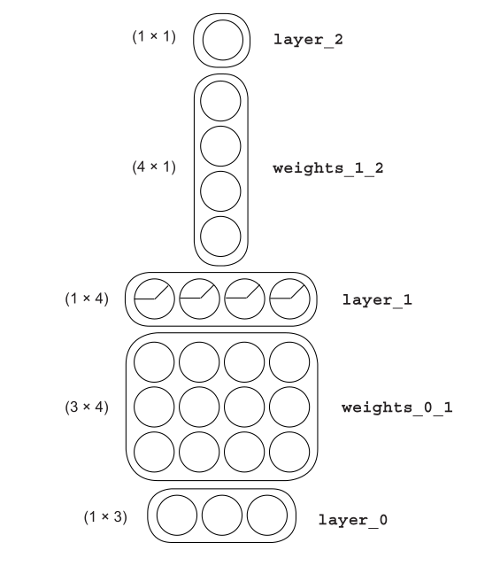
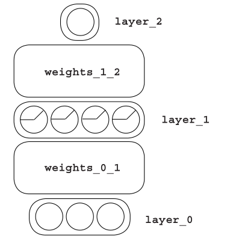
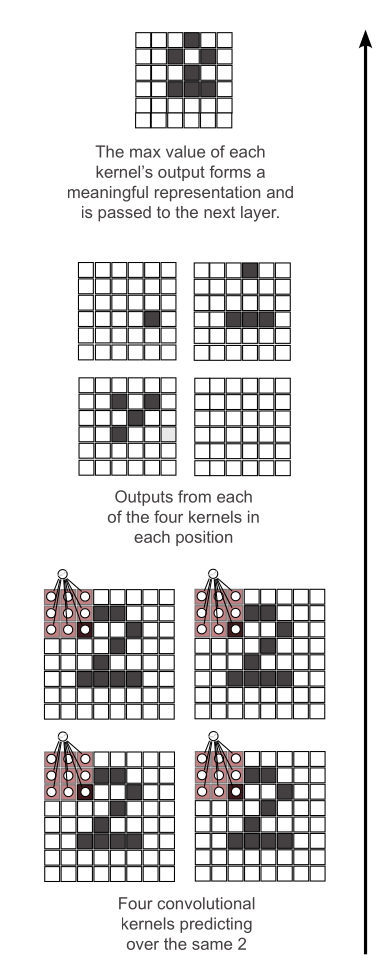
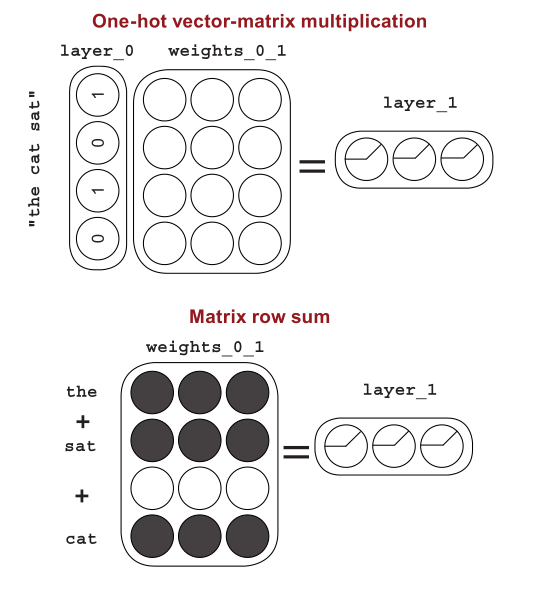
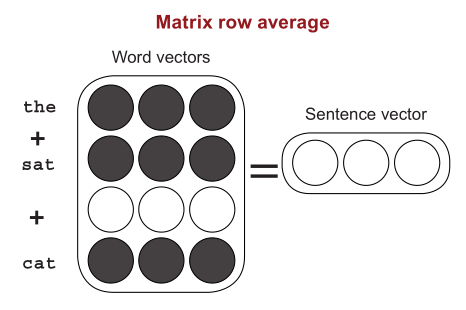
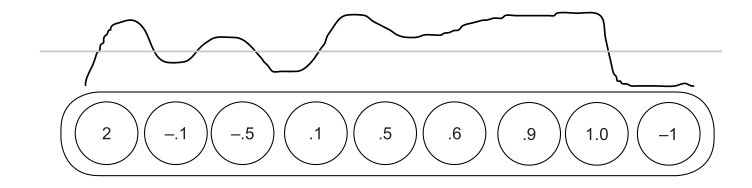
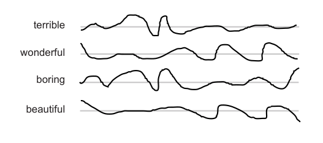
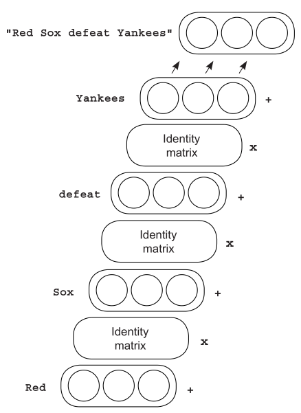
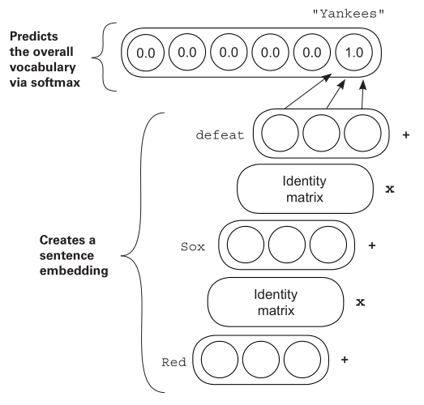

# Machine Learning

Grokking Deep Learning

## forward propagation

Just predict the output of the network. No training.

a network is just a butch of parameters, or number and its weight (the weight of each input).

## How the training works

> Predict, compare and learn

## Measuring Error

This reveals what learning in neural networks really is: a search problem. You’re searching
for the best possible configuration of weights so the network’s error falls to 0 (and predicts
perfectly).

### Hot and Cold learning

Up or down the parameters by comparing the error.

```python
if(down_error < up_error):
    weight = weight - step_amount
if(down_error > up_error):
    weight = weight + step_amount
```

### Direction and Amount

This method allows you to calculate both the *direction* and the *amount* you should change `weight` to reduce `error`.

```python
weight = .5
# the target prediction
goal_pred = .8
input = .5
iterations = 100
for i in range(iterations):
    pred = input * weight
    error = (pred - goal_pred) ** 2
    # pred - goal_pred is pure error
    # scaling, negative reversal and stopping
    delta = pred - goal_pred
    direction_and_amount = (pred - goal_pred) * input
    # weight = weight - direction_and_amount
    # You multiply weight_delta by a small number alpha before using it to update weight. This
    # lets you control how fast the network learns. I
    alpha = .01
    weight -= direction_and_amount * alpha
```

scaling, negative reversal and stopping translate the pure error into *absolute* value
you want to change *weight* by.

#### Stopping

If `input` is zero, then `direction_and_amount` will be zero. There's nothing to learn.

#### Negative Reversal

If `input` is negative, then `direction_and_amount` will change direction. Ensuring the `weight`
moves the correct direction even if `input` is negative.

#### Scaling

If `input` is big, then `direction_and_amount` will be big, so `weight` will move faster.
This is more of a side effect.

## Error Function

> Learning is adjusting the weight to reduce the error to 0.

For any `input` and `goal_pred`, an exact relationship is defined between error and weight,
found by combining the `prediction` and `error` formulas.

Eventually find the bottom of the bowl.

you modify specific parts of an *error function* until the error value goes to 0. This error
function is calculated using a combination of variables, some of which you can change (`weights`) and
some of which you can’t (input data, output data, and the error logic)

> You can modify anything in the `pred` calculation except `input`.

A neural network is really just one thing: a bunch of `weights` you use to
compute an `error function`. And for any `error function` (no matter how
complicated), you can compute the relationship between any `weight` and the
final `error` of the network. With this information, you can change each `weight` in the neural
network to reduce `error` down to *0* and that’s exactly what you’re going to do.

## `weight_delta` = `direction_and_amount` = derivative

You’re trying to figure out the direction and the amount to
change the weight so the error goes down. A derivative gives you the relationship between any
two variables in a function. You use the derivative to determine the relationship between any
weight and error. You then move the weight in the opposite direction of the derivative to find the
lowest weight. Voilà! The neural network learns.

## Overcorrection and Divergence

If you have a big input, the prediction is very sensitive to changes in the weight (because
`pred = input * weight`). This can cause the network to overcorrect.

### Alpha

The solution is to multiply the weight update by a
fraction to make it smaller. In most cases, this involves multiplying the weight update
by a single real-valued number between 0 and 1, known as **alpha**.

Finding the appropriate alpha, even for state-of-the-art neural networks, is often done
by guessing.

> Despite all the crazy advancements of deep learning in the past few years, most people just try several orders of
magnitude of alpha (10, 1, 0.1, 0.01, 0.001, 0.0001) and then tweak it from there to see what
works best. *It’s more art than science.*

## Multiple Input to one output

```python
delta = pred - goal_pred
weight_delta = delta * input
weight -= weight_delta * alpha
```

because each weight has a unique input and a shared `delta`, you use each
respective weight’s input multiplied by `delta` to create each respective
`weight_delta`.

### Freezing one weight

Well, the curves are a measure of each individual
weight relative to the global error. Thus,
because error is shared, when one weight finds
the bottom of the bowl, all the weights find the
bottom of the bowl.

Three of the dimensions are the weight
values, and the fourth dimension is the error.
This shape is called the `error` plane, and, believe
it or not, its curvature is determined by the
training data. Why is that the case?

`error` is determined by the training data. Any network can have any weight value, but
the value of `error` given any particular weight configuration is 100% determined by data.

## Multiple outputs by multiple iutput

Multiple outputs by one input?

> Each image is only 784 pixels (28 × 28). Given that you have
784 pixels as input and 10 possible labels as output (MNIST)
...You want to predict 10 probabilities: one for each digit. Given an input
drawing, the neural network will produce these 10 probabilities, telling you
which digit is most likely to be what was drawn.

## Visualizing the weight value

An interesting and intuitive
practice in neural network research
(particularly for image classifiers)
is to visualize the weights as if they
were an image.

## Different Gradient Descent

> In data matrices, it’s convention to give each recorded example a single row. It’s also
convention to give each thing being recorded a single column. This makes the matrix easy
to read.

- Stochastic gradient descent (update per row)
- Full gradient descent (update per dataset, which contains n row)
- Batch gradient descent  (update per x row)

## What's BP

All backpropagation lets you do is say, “Hey, if you want this node to be `x`
amount higher, then each of these previous four nodes needs to be
`x*weights_1_2` amount higher/lower, because these weights were amplifying the
prediction by `weights_1_2` times.”

### Learning corrlation

In reality, neural networks search for correlation between their input and *output* layers.

The goal is to train this network so that even though there’s no correlation between the input
dataset and output dataset (`layer_0` and `layer_2`), the `layer_1` dataset that you create
using `layer_0` will have correlation with `layer_2`.

The part that you don’t yet understand is how to update the weights between `layer_0`
and `layer_1`. What do they use as their error measure?

## Linear

> for any three-layer network you create, there’s a
two-layer network that has identical behavior. (if you just add a layer and the calculation is the same)

For any two consecutive weighted sums of the input, there exists a single
weighted sum with exactly identical behavior. Anything that the three-layer network can
do, the two-layer network can also do.

### Sometimes Correlation

But because you know that in the new dataset there is no correlation between any
of the inputs and the output, how can the middle layer help? It mixes up a bunch
of correlation that’s already useless. What you really need is for the middle
layer to be able to *selectively correlate* with the input.

> You want the middle layer to sometimes correlate with an input, and sometimes not correlate.

*Turn off the node when the value would be below 0.*

> By turning off any middle node whenever it would be negative, you allow the
network to sometimes subscribe to correlation from various inputs. This is impossible for
two-layer neural networks, thus adding power to three-layer nets.

The fancy term for this “if the node would be negative, set it to 0” logic is *nonlinearity*.

Use ReLU (Rectified Linear Unit)

> Adjusting the weights to reduce the error over a series of training examples ultimately
searches for correlation between the input and the output layers. If no correlation exists, then
the error will never reach 0.

Neural networks look for correlation between input and output, and you no longer have to
worry about how that happens. You just know it does.

```clojure
(use 'clojure.core.matrix)

;; already existed in clojure.core.matrix
;; (defn relu
;;   "ReLU activation function."
;;   [x]
;;   (max 0 x))
(defn drelu
  "Derivative of ReLU activation function."
  [x]
  (cond
    (sequential? x)
    (map drelu x)
    :else
    (if (> x 0) 1 0)))
(defn rearrange-dataset
  "convert two dataset to pair of (input, output) like zip function in Haskell"
  [x y]
  (if (= (count x) (count y))
    (map vector x y)
    nil))

(def streetlights
  [[1 0 1]
   [0 1 1]
   [0 0 1]
   [1 1 1]])
(def walk-vs-stop
  (transpose [[1 1 0 0]]))
(def dataset (rearrange-dataset streetlights walk-vs-stop))

(def hidden-node 4)
(def layer-0 (new-matrix 1 3))
(def weights-0-1 (new-matrix 3 hidden-node))
(def layer-1 (new-matrix 1 hidden-node))
(def weights-1-2 (new-matrix hidden-node 1))
(def layer-2 (new-matrix 1 1))
(def alpha 0.1)

;; init random weights
(defn fill-random
  [x]
  (cond (sequential? x) (map fill-random x) :else (rand)))

;; 3x4 matrix
(def weights-0-1 (fill-random weights-0-1))
;; 4x1 matrix
(def weights-1-2 (fill-random weights-1-2))

;; for some reason, 
;; (transpose [x y z w]) == [x y z w] != [[x] [y] [z] [w]]
;; you have to add a bracket
(loop [x 0]
  (when (< x 100)
    (doseq [data dataset]
      (let [[input result] data]
        (def layer-0 [input])
        (def layer-1 (relu (mmul layer-0 weights-0-1)))
        (def layer-2 (mmul layer-1 weights-1-2))
        (def error (esum (square (sub [result] layer-2))))
        ;; (println error)
        (def layer-2-delta (sub layer-2 [result]))
        (def layer-1-delta (emul (transpose (mmul weights-1-2 layer-2-delta)) (drelu layer-1)))
        (def weights-1-2-delta (mmul (transpose layer-1) layer-2-delta))
        (def weights-0-1-delta (mmul (transpose layer-0) layer-1-delta))
        (def weights-1-2 (sub weights-1-2 (emul weights-1-2-delta alpha)))
        (def weights-0-1 (sub weights-0-1 (emul weights-0-1-delta alpha)))))
    (if (= (mod x 10) 9) (println "[" x "]" " Error:" error))
    (recur (inc x))))

(defn pred
  "predict the value by the weights and input"
  [input weight-0-1 weight-1-2]
  (let [layer-0 [input]
        layer-1 (relu (mmul layer-0 weight-0-1))
        layer-2 (mmul layer-1 weight-1-2)]
    (emax layer-2)))
(pred [1 0 1] weights-0-1 weights-1-2)
(pred [0 1 1] weights-0-1 weights-1-2)
(pred [0 0 1] weights-0-1 weights-1-2)
(pred [1 1 1] weights-0-1 weights-1-2)
;; something different
(pred [1 0 0] weights-0-1 weights-1-2)
(pred [0 1 0] weights-0-1 weights-1-2)
(pred [0 0 0] weights-0-1 weights-1-2)
(pred [1 1 0] weights-0-1 weights-1-2)
;; it's know that the third variable is unrelated to the result

```

## Neural networks find and create correlation

Let’s create a name for this idea: the *correlation summarization.*

Neural networks seek to find direct and indirect correlation between an input layer and
an output layer, which are determined by the input and output datasets, respectively.

Given that a neural network is really just a series of matrices connected by layers

### Two layer Neural Network

When you have only two layers (*input* and *output*), the weight matrix knows what the
*output* layer says it should be based on the *output* dataset. It looks for correlation between
the input and output datasets because they’re captured in the input and output layers.

## Backpropagation

**Global correlation summarization**: What an earlier layer says it can be
*determined by taking what a later layer says it should be and
multiplying it by the weights in between them.

It’s like a giant game of telephone—at the end of the game, every layer knows which
of its neurons need to be higher and lower, and the local correlation summarization takes
over, updating the weights accordingly.

*Weight is matrix and Nodes are vector.* As you know, the neural network is a series of weight
matrices. When you’re using the network, you also end up creating vectors corresponding
to each layer.

## Neural networks are like LEGO bricks, and each brick is a vector or matrix



> The picture still gives you all
the information you need to build
a neural network. You know the
shapes and sizes of all the layers
and matrices.

### Simplifying further

In the previous section, you may have noticed a pattern. Each matrix’s
dimensionality (number of rows and columns) has a direct relationship to the
dimensionality of the layers before and after them.

Matrix dimention multiplication.

"`M`x*N*" matrix times "*N*x**P**" matrix is "`M`x**P**" matrix.

The different configurations of weights and layers between the input and output layers have a strong impact on whether the network is successful in finding correlation (and/or how fast it finds correlation).



The particular configuration of layers and weights in a neural network is called its *architecture*.

> Different architectures channel signal to make correlation easier to discover.
Good neural architectures channel signal so that correlation is easy to
discover. Great architectures also filter noise to help prevent overfitting.

### Use Letters to Visualize Architecture instead of pictures

Captical letter for matrix. I'll pick $W$ as weight.

Lower case letter for vector. I'll pick $l$ as layer.

$$\underset{1\times 4}{I_1} = \mathrm{relu}(\underset{1\times 3}{I_0}\times\underset{3\times 4}{W_0})$$

$$\underset{1\times 1}{I_2} = \underset{1 \times 4}{I_1} \times \underset{4\times 1}{W_1} = \mathrm{relu}(\underset{1\times 3}{I_0}\times\underset{3\times 4}{W_0}) \times \underset{4 \times 1}{W_1} $$

## Overfitting

When we froze the weight, the frozen weight still found the bottom of the bowl. For some
reason, the bowl moved so that the frozen weight value became optimal. Furthermore, if we
unfroze the weight to do some more training, it wouldn’t learn. Why? Well, the error had
already fallen to 0. As far as the network was concerned, there was nothing more to learn.

the more powerful the neural network’s expressive power (more layers and
weights), the more prone the network is to overfit.

### Neural networks can get worse if you train them too much

A more official definition of a neural network that overfits is a neural network that has
learned the noise in the dataset instead of making decisions based only on the *true signal*.

the mold got worse at the testing dataset as you imprinted more forks because it
learned more-detailed information about the training dataset it was being molded
to. This caused it to reject images that were even the slightest bit off from
what it had repeatedly seen in the training data.

One way is early stopping. It turns out a large amount of noise comes in the
fine-grained detail of an image, and most of the signal (for objects) is found
in the general shape and perhaps color of the image.

### Regularization

Regularization is a subfield of methods for getting a model to
generalize to new datapoints (instead of just memorizing the training data).
It’s a subset of methods that help the neural network learn the signal and
ignore the noise.

### Dropout

Industry standard regularization: Dropout

> Randomly turn off neurons (set them to 0) during training.

How do you get the power of a large neural network with the resistance to overfitting
of the small neural network? Take the big neural network and turn off nodes randomly.

Neural networks always start out randomly. It may learn equally effectively, but no two
neural networks are ever exactly the same (unless they start out exactly the same for some
random or intentional reason).

> Although it’s likely that large, unregularized neural networks will overfit to noise, it’s unlikely
they will overfit to the same noise.

If you allowed them to vote equally, their noise would tend to cancel out,
revealing only what they all learned in common `the signal`

> Neural networks, even though they’re randomly generated, still start by learning the biggest,
most broadly sweeping features before learning much about the noise.

To implement dropout on a layer (in this case, `layer_1`), multiply the `layer_1` values by a
random *matrix* of 1s and 0s.

each value in `dropout_mask` is 1, and (1 – 50% =50%) of the time, it’s 0. You need to counter this
by multiplying `layer_1` by (1 / *the percentage of turned on nodes*). In this case, that’s `1/0.5`,
which equals 2.

### Batch Gradient Descent

Previously we trained one training example at a time, updating the weights after each
example. Now, let’s train 100 training examples at a time, averaging the weight updates
among all 100 examples. There’s more going on here, however. Notice that `alpha` is 20 times larger than before.

## Activation Function

`relu` is one of them.

- Good activation functions are monotonic, never changing direction
- Good activation functions are nonlinear. In order to create *sometimes correlation*, you had to allow the neurons to selectively correlate to
input neurons such that a very negative signal from one input into a neuron could reduce
how much it correlated to any input
- Good activation functions (and their derivatives) should be efficiently computable.

> `tanh` likes to have a narrower random initialization, so I adjusted it to be between –0.01 and 0.01.

Personally, I don't think this part is important as you just need to look up the table.

## Output Layer vs Hidden Layer

It turns out that what’s best for hidden-layer activation functions can be quite different from
what’s best for output-layer activation functions, especially when it comes to classification.

## CNN

Overfitting is often caused by having more parameters than
necessary to learn a specific dataset. In this case, the network has so many
parameters that it can memorize every fine-grained detail in the training
dataset. When neural networks have lots of parameters but not
very many training examples, overfitting is difficult to avoid.

> As I mentioned, overfitting is concerned with the ratio between
the number of weights in the model and the number of
datapoints it has to learn those weights.

*Structure* is when you selectively choose to reuse weights for
multiple purposes in a neural network because we believe the
same pattern needs to be detected in multiple places.

But whereas normally removing parameters makes the model less expressive (less able
to learn patterns), if you’re clever in where you reuse weights, the model can be equally
expressive but more robust to overfitting.

The most famous and widely used structure in neural networks is called a *convolution*, and when used
as a layer it’s called a *convolutional layer*.

### Convolutional Layer

The core idea behind a convolutional layer is that instead of having a *large, dense linear*
*layer* with a connection from every input to every output, you instead have lots of very
*small linear layers*, usually with fewer than 25 inputs and a single output, which you
use in every input position.

The result will be a smaller square of kernel predictions, which are used
as input to the next layer. Convolutional layers usually have many kernels.

Each mini-layer is called a convolutional kernel, but it’s really nothing more
than a baby linear layer with a small number of inputs and a single output.

You can either sum these matrices **elementwise**
(*sum* pooling), take the mean **elementwise**
(*mean* pooling), or compute the **elementwise**
maximum value (*max* pooling). The last version turns out to be the most
popular.



It’s important to realize that this technique
allows *each kernel* to learn a particular pattern
and then search for the existence of that pattern
somewhere in the image.

Forward propagating them through a linear layer with one output neuron is
the same as predicting that linear layer over every subregion in every batch

Most uses of convolutional layers stack multiple layers on top of each other, such that each
convolutional layer treats the previous as an input image. (Feel free to do this as a personal
project; it will increase accuracy further.)

*Stacked convolutional* layers are one of the main developments that allowed for very deep
neural networks (and, by extension, the popularization of the phrase deep learning).

> Reusing weights is one of the most important innovations in deep learning.

Consider what you need to understand in order to detect that a cat is in an image.
You first need to understand colors, then lines and edges, corners and small shapes, and eventually
the combination of such lower-level features that correspond to a cat. Presumably, neural
networks also need to learn about these lower-level features (like lines and edges), and the
intelligence for detecting lines and edges is learned in the weights.

But if you use different weights to analyze different parts of an image, each section of
weights has to independently learn what a line is.

Convolutions are about taking advantage of a property of learning.

> **The Structure Trick** When a neural network needs to use the *same idea* in multiple places, endeavor to use the
*same weights* in both places. This will make those weights more intelligent by giving them
more samples to learn from, increasing generalization.

When you know a network will need the same idea in multiple places, force it to
use the same weights in those places.

## NLP

Supervised learning is all about taking “what you know” and transforming it into
“what you want to know.” Up until now, “what you know” has always consisted of
numbers in one way or another. But NLP uses text as input. How do you process
it?

Much as we converted the streetlight dataset, we need to convert the real-world
data (in this case, text) into a matrix the neural network can consume. As it
turns out, how we do this is extremely important!

We want to convert text into numbers in such a way that the
*correlation* between input and output is most obvious to the network. This will make for
faster training and better *generalization*.

The input data, however, is a bit trickier. To begin, let’s consider the raw data. It’s a list
of characters. This presents a few problems: not only is the input data text instead of
numbers, but it’s *variable-length text*. So far, neural networks always take an input of a
fixed size. You’ll need to overcome this.

### One Hot Encoding

Well, if there are 2,000 words, and you need a place in each vector for each
word, each vector will have 2,000 dimensions. This form of storage, called
one-hot encoding, is the most common format for encoding binary data (the binary
presence or absence of an input datapoint among a vocabulary of possible input datapoints).

```clojure
(ns nn.core)
;; use clojure.core.matrix namespace
(require '[clojure.core.matrix :as m]
         '[tech.v3.dataset :as ds]
         '[clojure.string :as str]
         '[clojure.math.numeric-tower :as math])

;; use the latest version (6.072) of tech.v3.dataset
;; Check print section of tech.v3.dataset walkthrough
;; https://techascent.github.io/tech.ml.dataset/walkthrough.html
;; Download the dataset from
;; https://www.kaggle.com/lakshmi25npathi/imdb-dataset-of-50k-movie-reviews
;; You excute in project root directory.
(def imdb-csv (vary-meta (ds/->dataset "data/IMDBDataset.csv" {:file-type :csv
                                                               :num-rows 5000})
                         assoc
                         :print-line-policy :single
                         :print-column-max-width 50))

(def tokens (map
            ;; replace <br /> and other common punctuation then split by space
            ;; and lower case them
             (fn [s] (str/split (str/replace (-> s (str) (str/lower-case))
                                             #"(?:\.|<br \/>|\?|\!|;|,|\"|\(|\)|\-|\:|[0-9]|\/|\\|\*|\{|\}|\[|\]|[^\x00-\x7F]|\'|\%|\`|\_)"
                                             " ")
                                #"\s+"))
             (imdb-csv "review")))

;; (rand-nth token)

(def vocab (into [] (set (flatten tokens))))

(count vocab)
(rand-nth vocab)

;; a hashmap key is word and value is its index
;; strangely index is start from 1
(def word-map (zipmap vocab (iterate inc 1)))
;; (word-map "love")
;; get a list of sentence and each sentence is a list of word index
;; this is the input dataset
(def index-sentence (map (fn [sentence] (map (fn [t] (word-map t)) sentence)) tokens))
(def target (map (fn [result] (if (= "positive" result) 1 0)) (imdb-csv "sentiment")))
```

### Embedding Layer

- https://www.zhihu.com/question/45027109
- https://fuhailin.github.io/Embedding/

> Embedding layer的作用主要在于学习词语的distributed representation并将极其稀疏的one-hot编码的词语进行降维。one-hot编码的稀疏性决定了它很难把握词语之间的相似性，包括词性，语义信息等等，比如car和bus或多或少具有相似性，one-hot编码却难以衡量。经过embedding之后，一个长达数十万的稀疏vector被映射到数百维的稠密vector，这个稠密vector的每一个特征可以认为是有实际意义的，比如单复数，名词动词等等。在语言模型里，具有相似特性和意义的词语往往具有相似的周边词语，通过语言模型的训练，相似词语往往会具有相似的稠密vector表示，因此词语之间的相似性便可以简单的利用向量之间角度来衡量。像word2vec里可以对词进行类比的加减法也是利用了这个特性。

Because the sentiment vocabulary is on the order of 70,000 words, most of the
vector-matrix multiplication is spent multiplying 0s in the input vector by
different rows of the matrix before summing them.

> Selecting the rows corresponding to each word in a matrix and summing them is
much more efficient.



### Interpret the result

Furthermore, it’s extremely beneficial to consider what patterns
of language would be detected by the correlation summarization,
and more importantly, which ones wouldn’t.

understanding the difference between what the
network (in its current configuration) is capable of learning relative to what it needs to
know to properly understand language is an incredibly fruitful line of thinking.

You present the presence or absence of a word. As such, the
correlation summarization will find direct correlation between
this presence/absence and each of the two labels.

But we used a network that has a hidden layer. This begs the question, what
does this hidden layer do?

#### Grouping

Fundamentally, hidden layers are about grouping datapoints from a previous layer into n
groups (where n is the number of neurons in the hidden layer). Each hidden neuron takes in
a datapoint and answers the question, “Is this datapoint in my group?” As the hidden layer
learns, it searches for useful groupings of its input.

a grouping is useful if it’s an actual phenomenon in the data that you care about.
Bad groupings just memorize the data. Good groupings pick up on phenomena that are
useful linguistically.

But because the input to the neural network is the vocabulary of a review, “it was great,
not terrible” creates exactly the same `layer_1` value as “it was terrible, not great.”
For this reason, the network is very unlikely to create a hidden neuron that understands negation.

If you can construct two examples with an identical hidden layer, one with the
pattern you find interesting and one without, the network is unlikely to find
that pattern.

#### Weights

Words that have a similar predictive power should subscribe to similar groups (hidden neuron
configurations). Words that correlate with similar labels
(positive or negative) will have similar weights connecting
them to various hidden neurons.

#### Visualize Weight Similarity

Each entry in the row represents each weight proceeding from that row’s word to each hidden neuron. Thus, to
figure out which words are most similar to a target term, you compare each word’s vector
(row of the matrix) to that of the target term. The comparison of choice is called Euclidian
distance.

### Filling in the blank

First, instead of predicting a single label given a movie review, you’ll take each
(five-word) phrase, remove one word (a focus term), and attempt to train a network to figure
out the identity of the word you removed using the rest of the phrase. Second, you’ll use a trick
called negative sampling to make the network train a bit faster.

The key takeaway is that, even though the network trained over the same dataset with a very
similar architecture (three layers, cross entropy, sigmoid nonlinear), you can influence what
the network learns within its weights by changing *what you tell the network to predict*.

### Loss Function, Again

you can influence what the network learns within its weights by changing what you tell the network to predict. Even
though it’s looking at the same statistical information, you can target what it learns based
on what you select as the input and target values. For the moment, let’s call this process of
choosing what you want the network to learn *intelligence targeting*.

Controlling the *input/target* values isn’t the only way to perform intelligence targeting. You
can also adjust how the network measures error, the size and types of layers it has, and the
types of regularization to apply. In deep learning research, all of these techniques fall under
the umbrella of constructing what’s called a **loss function**.

> Neural networks don’t really learn data; they minimize the loss function.

I (the author) encourage you not to think about this from the perspective
of two different steps (forward propagation, then error evaluation), but instead to consider
the entire formula (including forward prop) to be the evaluation of an error value.

Even though the network and datasets were similar, the error function was fundamentally different,
leading to different word clusterings within each network.

Two neural networks can have identical starting weights, be trained
over identical datasets, and ultimately learn very different patterns because you choose
a different loss function.

Whenever you want a neural network to learn a pattern, everything you need to know to do
so will be contained in the loss function. When you had only a single weight, this allowed
the loss function to be simple, But as you chain large numbers of complex layers
together, the loss function will become more complicated (and that’s OK).

### Word Analogies

The task of filling in the blank creates word embeddings with interesting
phenomena known as word analogies, wherein you can take the vectors for different words
and perform basic algebraic operations on them.

> Word analogies are an interesting consequence of the previously built network.

Oversimplified, “king” subscribes to the male and the royal dimensions of the hidden layer,
whereas “queen” subscribes to the female and royal dimensions of the hidden layer.

## Recurrent layers for variable-length data

循环神经网络（Recurrent neural network：RNN）

> Vanilla RNNs suffer from vanishing and exploding gradients.

 LSTMs are the industry standard model to counter
vanishing/exploding gradients.

### Comparisons

The act of comparing two vectors is useful because it gives an approximation of what the
neural network sees. Even though you can’t read two vectors, you can tell when they’re
similar or different

> What if you take the vector for each word in a sentence, and average them?



As it turns out, averaging word embeddings is a surprisingly effective way to create word
embeddings. It’s not perfect (as you’ll see), but it does a strong job of capturing what you
might perceive to be complex relationships between words.

> The surprising power of averaged word vectors It’s the amazingly powerful go-to tool for neural prediction.



Instead of thinking of a vector as a list of numbers, think about it as a line with high and low
points corresponding to high and low values at different places in the vector.



> Neural networks detect the curves that have correlation with a target label.

Words with similar meaning in one way or another will often share a distinctive
bend in the curve: a combination of high-low pattern among the weights.

Truth be told, a neural network consumes embeddings just as it consumed the streetlight
dataset in the book’s early chapters. It looks for *correlation* between the various bumps and
curves in the hidden layer and the target label it’s trying to predict.
At some point during training, a neural network starts developing unique characteristics between the shapes of
different words so it can tell them apart, and grouping them (giving them similar bumps/
curves) to help make accurate predictions.

But note that this approach is a bit mushy: given enough words,
these different wavy lines should all average together to generally be a straight line.

when attempting to store arbitrarily long sequences (a sentence) of information into a *fixed-length vector*, if you try to store too
much, *eventually the sentence vector (being an average of a multitude of word vectors) will
average out to a straight line (a vector of near 0s).

### Order and RNN

> Order becomes irrelevant when you average word embeddings. The limitations of bag-of-words vectors

The biggest issue with average embeddings is that they have *no concept of order*.

In order to show you how it works, we’ll start by coming up with a new,
and seemingly wasteful, way of doing the average word embeddings
using something called an *identity matrix*.

> In this case, we’ll use it as a teaching tool to show how to set up a more
complicated way of summing the word embeddings so the neural network can take
order into account when generating the final sentence embedding.



In fact, the identity matrix is the only matrix guaranteed to return the same
vector that it’s vector-matrix multiplied with. No other matrix has this
guarantee.

Note that because the vector-matrix multiplication by
the identity matrix returns the same vector that goes into it, the process on the right yields
exactly the same sentence embedding as the process original.

> What if you allowed the identity matrices to change to minimize the loss?

The theory is that if we use the identity-matrix *way* of creating sentence embeddings,
but used any **other matrix other than the identity matrix**, the sentence embeddings would be
different depending on the order.

> what matrix to use instead of the identity matrix.

In deep learning, the standard answer to this kind of question is, “You’ll learn
the matrix just like you learn any other matrix in a neural network!”



- create the sentence embedding
- use that embedding to predict which word comes next

This matrix will only **start as an identity matrix.** During training, you’ll
backpropagate gradients into these *matrices* and *update* them to help the network
make better predictions

> how does a neural network fit a variable amount of information into a fixed-size
box? The truth is, sentence vectors don’t encode everything in the sentence.
Most RNNs learn that only the *last couple of words* are really necessary, and they
learn to forget (aka, not make unique patterns in their vectors for) words further back in
the history.

## Framework

> Oversimplified, frameworks are autograd + a list of prebuilt layers and optimizers.

Concretely, the most beneficial pieces of a deep learning framework are its
support for automatic backpropagation and automatic optimization. These features
let you specify *only the forward propagation code* of a model, with the
framework taking care of backpropagation and weight updates automatically.

### Tensor

Tensors are an abstract form of vectors and matrices.

A tensor is the abstract version of this form of nested lists of
numbers. A vector is a one-dimensional tensor. A matrix is a two-dimensional tensor, and
higher dimensions are referred to as n-dimensional tensors.

### Autograd

first compute the gradient at the output of the network, then
use that result to compute the derivative at the next-to-last component, and so on until all
weights in the architecture have correct gradients.

You just didn’t explicitly encode the nodes and edges in a graphical data structure.
Instead, you had a list of layers (dictionaries) and hand-coded the correct order of forward and
backpropagation operations.

In general, *dynamic computation graphs* are easier to write/experiment with,
and *static computation graphs* have faster runtimes because of some fancy logic
under the hood. The primary difference is whether *forward propagation* is happening
during *graph construction* or after the graph is already defined.

## long short-term memory network (LSTM)

LSTM gates are semantically similar to reading/writing from memory.
